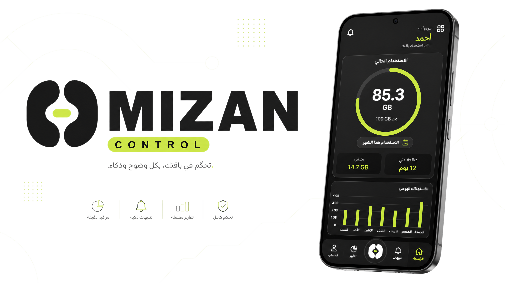

<div align="center">
  
  <br />
  
  <h1>ميزان | MIZAN CONTROL</h1>
  <p><strong>نظام ذكي لإدارة استهلاك الإنترنت المنزلي وتوزيع الحصص بعدالة ووضوح</strong></p>
  
  <p>
    
    
    
  </p>
</div>

---

## 🌟 عن المشروع
**ميزان** هو تطبيق أندرويد عصري مصمم لمساعدة أفراد المنزل على فهم وإدارة استهلاك باقة الإنترنت الشهرية. يتميز التطبيق بلغة بصرية هادئة وراقية، تبتعد عن تعقيدات لوحات التحكم التقليدية لتقدم تجربة مستخدم تشبه تطبيقات الإدارة المالية الشخصية أو تطبيقات الرفاهية.

يعتمد المشروع على مبدأ **العدالة والشفافية**، حيث يوفر لكل مستخدم رؤية واضحة لاستهلاكه الشخصي وتنبيهات ذكية عند اقتراب انتهاء الحصة المخصصة له.

## 🎨 الهوية البصرية (Visual Identity)
تم بناء الهوية البصرية لميزان لتعكس الثقة والهدوء والتحكم الكامل:
- **الألوان الأساسية:** مزيج احترافي بين الفحم العميق (#151515) والليموني المنعش (#C8F24A) على خلفيات ورقية دافئة (#F6F7F2).
- **التصميم:** بطاقات معيارية بزوايا دائرية (24dp-28dp)، أيقونات خطية بسيطة، ومساحات بيضاء واسعة تمنح شعوراً بالراحة.
- **الخطوط:** استخدام خطوط عربية حديثة (IBM Plex Sans Arabic) لضمان وضوح القراءة ودعم اتجاه النص من اليمين لليسار (RTL).

## 🚀 المميزات الرئيسية
| الميزة | الوصف |
|---|---|
| **مراقبة دقيقة** | تتبع حي لاستهلاك البيانات بالجيجابايت والنسب المئوية. |
| **توزيع الحصص** | إمكانية تحديد حصص مخصصة لكل جهاز متصل بالشبكة. |
| **تنبيهات ذكية** | إشعارات فورية عند الوصول لمستويات استهلاك محددة. |
| **تحليل الاستهلاك** | رسوم بيانية توضح متوسط الاستهلاك اليومي وأكثر التطبيقات استهلاكاً. |
| **وضع الإيقاف المؤقت** | حماية الباقة من النفاذ المفاجئ عبر إيقاف الإنترنت عند انتهاء الحصة. |

## 🛠️ البنية التقنية (System Design)
يتبع التطبيق بنية برمجية تعتمد على نماذج الحالة الصريحة (Explicit State Models) لضمان استقرار الواجهة:
- **SetupRequired:** مرحلة الإعداد الأولي وربط الكود.
- **ActiveUsage:** لوحة التحكم الرئيسية ومتابعة الاستهلاك.
- **QuotaExhausted:** حالة انتهاء الحصة وتقييد الوصول.

## 📦 التشغيل المحلي
1. تأكد من تثبيت **Node.js**.
2. قم بتثبيت الاعتمادات:
   ```bash
   npm install
   ```
3. ابدأ وضع التطوير:
   ```bash
   npm run dev
   ```

---

<div align="center">
  <p>تم تطوير هذا المشروع برؤية تركز على الإنسان وتجعل التكنولوجيا أداة للعدالة والوضوح.</p>
  <p><strong>MIZAN - Control with Clarity.</strong></p>
</div>
